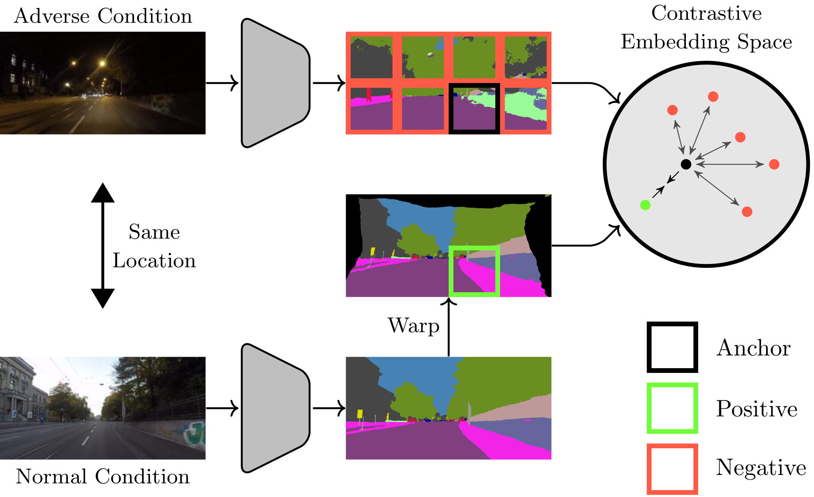

 ---

<div align="center">    
 
# Contrastive Model Adaptation for Cross-Condition Robustness in Semantic Segmentation

[](https://arxiv.org/abs/2303.05194)

</div>

Official code for the paper [Contrastive Model Adaptation for Cross-Condition Robustness in Semantic Segmentation](TODO). The code is organized using [PyTorch Lightning](https://github.com/Lightning-AI/lightning). 



## Abstract

Standard unsupervised domain adaptation methods adapt models from a source to a target domain using labeled source data and unlabeled target data jointly. In model adaptation, on the other hand, access to the labeled source data is prohibited, i.e., only the source-trained model and unlabeled target data are available. We investigate normal-to-adverse condition model adaptation for semantic segmentation, whereby image-level correspondences are available in the target domain. The target set consists of unlabeled pairs of adverse- and normal-condition street images taken at GPS-matched locations. Our method--CMA--leverages such image pairs to learn condition-invariant features via contrastive learning. In particular, CMA encourages features in the embedding space to be grouped according to their condition-invariant semantic content and not according to the condition under which respective inputs are captured. To obtain accurate cross-domain semantic correspondences, we warp the normal image to the viewpoint of the adverse image and leverage warp-confidence scores to create robust, aggregated features. With this approach, we achieve state-of-the-art semantic segmentation performance for model adaptation on several normal-to-adverse adaptation benchmarks, such as ACDC and Dark Zurich. We also evaluate CMA on a newly procured adverse-condition generalization benchmark and report favorable results compared to standard unsupervised domain adaptation methods, despite the comparative handicap of CMA due to source data inaccessibility.


## Usage
### Requirements

The code is run with Python 3.10.4. To install the packages, use:
```bash
pip install -r requirements.txt
```

### Optional

Local correlation is implemented through [this custom CUDA extension](https://github.com/ClementPinard/Pytorch-Correlation-extension). By default the extension is built just in time using Ninja. In case of problems, the extension can be alternatively pre-installed in the environment (see also the README of the linked repo):
```bash
pip install spatial-correlation-sampler
```


### Set Data Directory

The following environment variable must be set:
```bash
export DATA_DIR=/path/to/data/dir
```

### Download the Data

Before running the code, download and extract the respective datasets to the directory `$DATA_DIR`.

<details>
  <summary>ACDC</summary>
  
  Download rgb_anon_trainvaltest.zip and gt_trainval.zip from [here](https://acdc.vision.ee.ethz.ch/download) and extract them to `$DATA_DIR/ACDC`.

  ```
  $DATA_DIR
  ├── ACDC
  │   ├── rgb_anon
  │   │   ├── fog
  │   │   ├── night
  │   │   ├── rain
  │   │   ├── snow
  │   ├── gt
  │   │   ├── fog
  │   │   ├── night
  │   │   ├── rain
  │   │   ├── snow
  ├── ...
  ```
</details>

<details>
  <summary>Dark Zurich</summary>
  
  Download Dark_Zurich_train_anon.zip, Dark_Zurich_val_anon.zip, and Dark_Zurich_test_anon_withoutGt.zip from [here](https://www.trace.ethz.ch/publications/2019/GCMA_UIoU/) and extract them to `$DATA_DIR/DarkZurich`.

  ```
  $DATA_DIR
  ├── DarkZurich
  │   ├── rgb_anon
  │   │   ├── train
  │   │   ├── val
  │   │   ├── val_ref
  │   │   ├── test
  │   │   ├── test_ref
  │   ├── gt
  │   │   ├── val
  ├── ...
  ```
</details>

<details>
  <summary>RobotCar</summary>
  
  Download all data from [here](https://data.ciirc.cvut.cz/public/projects/2020VisualLocalization/Cross-Seasons-Correspondence/ROBOTCAR/) and save them to `$DATA_DIR/RobotCar`. As mentioned in the corresponding README.txt, the images must be downloaded from [this link](https://drive.google.com/drive/folders/19yUB49EliCnWThuN2HUukIryX47JWmQp).

  ```
  $DATA_DIR
  ├── RobotCar
  │   ├── images
  │   │   ├── dawn
  │   │   ├── dusk
  │   │   ├── night
  │   │   ├── night-rain
  │   │   ├── ...
  │   ├── correspondence_data
  │   │   ├── ...
  │   ├── segmented_images
  │   │   ├── training
  │   │   ├── validation
  │   │   ├── testing
  ├── ...
  ```
</details>


### Model Checkpoints and Results

We provide the following model checkpoints and validation set predictions:

| Method         | Architecture           | Dataset       | Test mIoU    | Config      |  Checkpoint    |   Predictions  |
|---------------|----------------|-----------------|-----------------|------------|----------------|------------|
| CMA | SegFormer | ACDC | 69.1 | [config](https://github.com/brdav/cma/blob/main/configs/cma_segformer_acdc.yaml) | [model](https://data.vision.ee.ethz.ch/brdavid/cma/cma_segformer_acdc.ckpt) | [ACDC val](https://data.vision.ee.ethz.ch/brdavid/cma/colored_preds_val_ACDC_cma_segformer.zip) 
| CMA | DeepLabv2 | ACDC | 50.4 | [config](https://github.com/brdav/cma/blob/main/configs/cma_deeplabv2_acdc.yaml) | [model](https://data.vision.ee.ethz.ch/brdavid/cma/cma_deeplabv2_acdc.ckpt) | [ACDC val](https://data.vision.ee.ethz.ch/brdavid/cma/colored_preds_val_ACDC_cma_deeplabv2.zip) 
|||||||
| CMA | SegFormer | Dark Zurich | 53.6 | [config](https://github.com/brdav/cma/blob/main/configs/cma_segformer_darkzurich.yaml) | [model](https://data.vision.ee.ethz.ch/brdavid/cma/cma_segformer_darkzurich.ckpt) | [Dark Zurich val](https://data.vision.ee.ethz.ch/brdavid/cma/colored_preds_val_DarkZurich_cma_segformer.zip) 
|||||||
| CMA | SegFormer | RobotCar | 54.3 | [config](https://github.com/brdav/cma/blob/main/configs/cma_segformer_robotcar.yaml) | [model](https://data.vision.ee.ethz.ch/brdavid/cma/cma_segformer_robotcar.ckpt) | [RobotCar val](https://data.vision.ee.ethz.ch/brdavid/cma/colored_preds_val_RobotCar_cma_segformer.zip) 


### Create Pseudo-Labels (Optional)

Before training CMA, optionally create pseudo-labels using the source model. For example for a SegFormer architecture on ACDC:
```bash
python -m tools.run generate_pl --config configs/cma_segformer_acdc.yaml --trainer.accelerator gpu
```
This will save the pseudo-labels to `$DATA_DIR/pseudo_labels`. If this step is skipped, precomputed pseudo-labels will be automatically downloaded to `$DATA_DIR/pseudo_labels` on the first training run.


### Training

To train CMA (with AMP), e.g. for a SegFormer architecture on ACDC, use the following command:
```bash
python -m tools.run fit --config configs/cma_segformer_acdc.yaml --trainer.accelerator gpu --trainer.precision 16
```
Note that a GPU with around 20 GB memory is needed to train CMA. See `configs/` for config files for other datasets and architectures. See the [Lightning CLI Docs](https://pytorch-lightning.readthedocs.io/en/1.9.3/cli/lightning_cli.html) for more information on how to control hyperparameters etc.


### Testing

To evaluate CMA, provide the model checkpoint as argument, e.g. for a SegFormer architecture on RobotCar:
```bash
python -m tools.run test --config configs/cma_segformer_robotcar.yaml --trainer.accelerator gpu --ckpt_path /path/to/checkpoint.ckpt
```

For ACDC and Dark Zurich, this command would compute the performance on the validation set. To get test set scores, predictions are evaluated on the respective evaluation servers: [ACDC](https://acdc.vision.ee.ethz.ch/submit) and [Dark Zurich](https://codalab.lisn.upsaclay.fr/competitions/3783).
To create and save test predictions for e.g. ACDC, use this command:
```bash
python -m tools.run predict --config configs/cma_segformer_acdc.yaml --trainer.accelerator gpu --ckpt_path /path/to/checkpoint.ckpt
```

## ACG Benchmark

To evaluate a model on the ACG benchmark, first download the filename lists and instructions here: [ACG Benchmark](https://data.vision.ee.ethz.ch/brdavid/cma/ACG.zip)

See the README file of the downloaded ACG bundle for details on how to retrieve and arrange the necessary datasets. In summary, the file structure should look as follows:

```
$DATA_DIR
├── ACG
│   ├── ...
├── WildDash2
│   ├── ...
├── bdd100k
│   ├── ...
├── Foggy_Driving
│   ├── ...
├── Foggy_Zurich
│   ├── ...
```

Before running the evaluation, uncomment the respective lines in the config file (in the dataloader and the metrics settings). Then test the model as usual:
```bash
python -m tools.run test --config configs/cma_segformer_acdc.yaml --trainer.accelerator gpu --ckpt_path /path/to/checkpoint.ckpt
```

## Citation

If you find this code useful in your research, please consider citing the paper:
```bibtex
@article{bruggemann2023contrastive,
  title={Contrastive Model Adaptation for Cross-Condition Robustness in Semantic Segmentation},
  author={Bruggemann, David and Sakaridis, Christos and Broedermann, Tim and Van Gool, Luc},
  journal={arXiv preprint arXiv:2303.05194},
  year={2023}
}
```

## License

This repository is released under the MIT license. However, care should be taken to adopt appropriate licensing for third-party code in this repository. Third-party code is marked accordingly.

## Contact

For questions about the code or paper, feel free to contact me ([send email](mailto:brdavid@vision.ee.ethz.ch)).